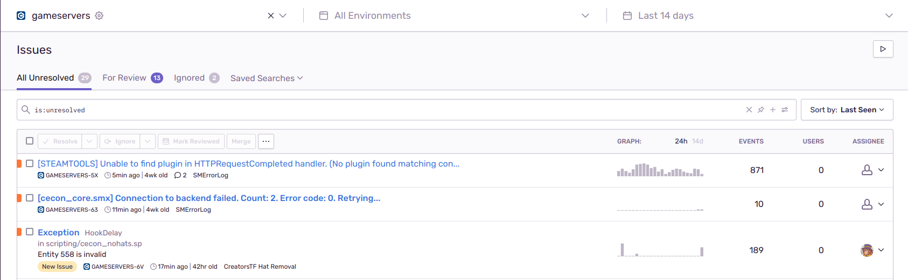

# Sourcemod Sentry Error Logger
Log sourcemod errors and sourcepawn exceptions to a [sentry.io](https://sentry.io/welcome/) instance.

Originaly made for use on Creators.TF servers, but can be used on any TF2 server running sourcemod.

## Setup
On your Sentry.io instance, set up a project and get the SDK DSN url. Use this as the value for ``ce_sentry_dsn_url``.

Put either the .dll or .so extension in your servers sourcemod/extensions folder.
Create a .autoload file if you want the plugin to load on server start *(e.g. ctferrorlogger.autoload)*.

## Requirements
A TF2 server running an up to date version of sourcemod.

Linux servers require **curl4** (x32 bit version) to be installed. 

If you see an error message such as "``libcurl.so.4: cannot open shared object file: No such file or directory``" when trying to load the extension, you are missing curl4.

### How to install curl 4 via apt for Debian/Ubuntu based distros:
- Allow installing x32 bit versions of packages: ``sudo dpkg --add-architecture i386``

- Update apt sources: ``sudo apt-get update``

- Install i368(x32) version of curl 4: ``sudo apt-get install libcurl4:i386``

## Convars
- ``ce_sentry_dsn_url`` Sentry DSN url, required. Extension will not setup without this.

- ``ce_logreaderwaittime`` How many seconds between re checking for new log errors.

- ``ce_server_index`` Server number (not required)

- ``ce_environment`` Server environment (not required)

- ``ce_region`` Server region (not required)

- ``ce_type`` Server type (not required)

## Known Issues
- The extension may not properly work if it is unloaded then reloaded, but unloading should be fine.

- The extension gets sourcemod errors (not exceptions) via reading the latest error log file. If there is a better way to achieve this, please let me know! This process is done on a timer as to not waste resources.

If you experience a new bug/crash, please create an issue here.

## Building
Ensure you have the required dependencies for [building Sourcemod](https://wiki.alliedmods.net/Building_sourcemod).

Currently, the sourcemod and sdk dependency locations are assumed to be where they exist for the sample extensions, so clone this repo into <sourcemod repo>/public folder. Metamod, Sourcemod and hl2sdk-tf2 are needed.
### Linux:
Install/update ``g++``, ``gcc``, ``g++-multilib``, ``gcc-multilib`` and ``libcurl4-openssl-dev:i386`` via your package manager.

> [!IMPORTANT]
> If libcurl4-openssl-dev:i386 cannot be installed via your package manager (due to an error) the x64 version may need to be removed.

Use the provided make file via ``make``. Requires GCC 8 and above for full STD 17 support (w filesystem). (Ambuild cannot be used due to linker errors).
### Windows:
Open and build using the solution file (``ctferrorloggerext.sln``). Ambuild can also be used for windows.
